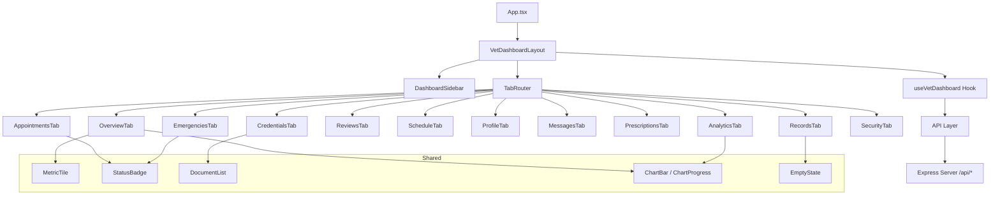
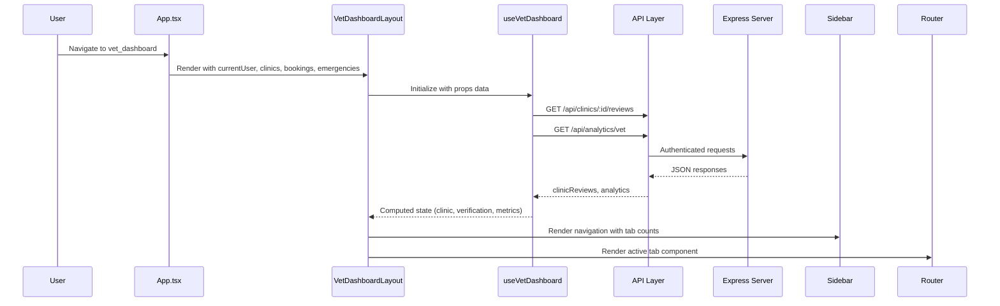
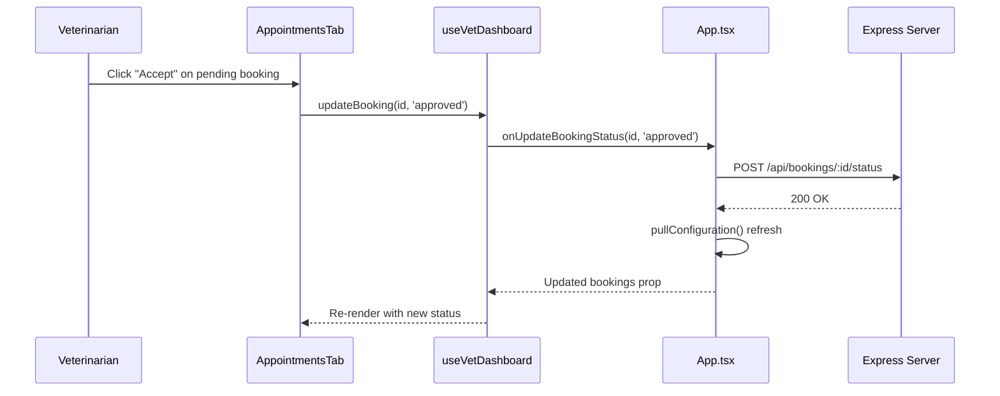

# Design Document: Vet Dashboard Redesign

## Overview

The Vet Dashboard Redesign restructures the existing monolithic `VetDashboard.tsx` component (~900 lines) into a modular, maintainable architecture with improved separation of concerns. The current implementation combines all 12 tabs (overview, appointments, emergencies, records, reviews, schedule, profile, messages, prescriptions, analytics, credentials, security) into a single file with inline state management, duplicate data fetching, and tightly coupled UI rendering.

The redesign introduces a component-per-tab architecture, a centralized data hook (`useVetDashboard`), a dedicated layout shell, and proper TypeScript interfaces for all inter-component contracts. It preserves 100% of existing functionality while enabling future extensibility (real-time notifications, drag-and-drop scheduling, prescription PDF generation) and improving performance via lazy loading and memoization.

The existing backend API remains unchanged — the redesign is purely a frontend refactor targeting the React component layer and its data flow patterns.

## Architecture



## Sequence Diagrams

### Dashboard Initialization Flow



### Appointment Status Update Flow



## Components and Interfaces

### Component 1: VetDashboardLayout

**Purpose**: Top-level layout shell that orchestrates sidebar, tab routing, and verification gating.

**Interface**:
```typescript
interface VetDashboardLayoutProps {
  currentUser: User;
  clinics: VetClinic[];
  bookings: Booking[];
  emergencies: EmergencyRequest[];
  onUpdateBookingStatus: (id: string, status: string) => Promise<void>;
  onUpdateEmergencyStatus: (id: string, status: string, clinicId: string, clinicName: string) => Promise<void>;
}
```

**Responsibilities**:
- Render the sidebar + main content grid layout
- Gate tab access based on verification status
- Provide `useVetDashboard` context to child tabs
- Handle the "no clinic" fallback state

### Component 2: DashboardSidebar

**Purpose**: Vertical navigation panel with user profile card, verification badge, and tab buttons.

**Interface**:
```typescript
interface DashboardSidebarProps {
  currentUser: User;
  clinic: VetClinic;
  verification: VerificationInfo;
  isApproved: boolean;
  activeTab: VetTab;
  onTabChange: (tab: VetTab) => void;
  tabs: TabDefinition[];
}

interface TabDefinition {
  id: VetTab;
  label: string;
  icon: LucideIcon;
  count?: number;
}

interface VerificationInfo {
  label: string;
  tone: string;
  message: string;
}
```

**Responsibilities**:
- Display user avatar, name, and clinic name
- Show verification status banner
- Render navigation buttons with active state and badge counts
- Disable locked tabs when not approved

### Component 3: OverviewTab

**Purpose**: Home view showing key metrics, weekly trends chart, and priority queue.

**Interface**:
```typescript
interface OverviewTabProps {
  metrics: DashboardMetrics;
  appointmentsPerWeek: SeriesPoint[];
  priorityItems: PriorityItem[];
}

interface DashboardMetrics {
  todaysAppointments: number;
  upcomingAppointments: number;
  emergencies: number;
  rating: string;
  patients: number;
  messages: number;
  earnings: string;
  successRate: string;
}

interface PriorityItem {
  id: string;
  type: 'booking' | 'emergency';
  title: string;
  description: string;
}
```

### Component 4: AppointmentsTab

**Purpose**: Full appointment management with filter toolbar and action buttons.

**Interface**:
```typescript
interface AppointmentsTabProps {
  bookings: Booking[];
  loadingId: string | null;
  onUpdateStatus: (id: string, status: 'approved' | 'completed' | 'cancelled') => void;
}
```

### Component 5: EmergenciesTab

**Purpose**: Emergency request list with accept/complete actions.

**Interface**:
```typescript
interface EmergenciesTabProps {
  emergencies: EmergencyRequest[];
  clinicId: string;
  loadingId: string | null;
  onAccept: (id: string) => void;
  onComplete: (id: string) => void;
}
```

### Component 6: AnalyticsTab

**Purpose**: Performance charts and detailed statistics.

**Interface**:
```typescript
interface AnalyticsTabProps {
  clinicBookings: Booking[];
  ownedEmergencies: EmergencyRequest[];
  analytics: VetAnalyticsData | null;
  analyticsLoading: boolean;
}
```

### Shared Components

```typescript
// MetricTile - reusable KPI display card
interface MetricTileProps {
  icon: LucideIcon;
  label: string;
  value: string | number;
  hint: string;
}

// StatusBadge - booking/emergency status indicator
interface StatusBadgeProps {
  status: string;
}

// EmptyState - consistent empty content placeholder
interface EmptyStateProps {
  message: string;
}

// ChartBar - simple bar chart visualization
interface ChartBarProps {
  data: SeriesPoint[];
  color?: string;
  height?: number;
}

// ChartProgress - horizontal progress bar list
interface ChartProgressProps {
  data: SeriesPoint[];
  color?: string;
}
```

## Data Models

### VetTab Type

```typescript
type VetTab =
  | 'overview'
  | 'appointments'
  | 'emergencies'
  | 'records'
  | 'reviews'
  | 'schedule'
  | 'profile'
  | 'messages'
  | 'prescriptions'
  | 'analytics'
  | 'credentials'
  | 'security';
```

### VetAnalyticsData

```typescript
interface SeriesPoint {
  label: string;
  value: number;
}

interface VetAnalyticsData {
  summary: {
    todaysAppointments: number;
    upcomingAppointments: number;
    completedAppointments: number;
    emergencyCases: number;
    patientCount: number;
    averageRating: number;
    reviews: number;
    monthlyEarnings: number;
    responseTime: number;
    successRate: number;
    notifications: number;
  };
  charts: {
    appointmentsPerWeek: SeriesPoint[];
    monthlyPatients: SeriesPoint[];
    ratingsTrend: SeriesPoint[];
    appointmentStatus: SeriesPoint[];
    patientCategories: SeriesPoint[];
  };
  recentReviews: Array<{
    userName: string;
    rating: number;
    reviewText: string;
    date: string;
    petType: string;
  }>;
}
```

**Validation Rules**:
- `rating` values must be between 0 and 5
- `SeriesPoint.value` must be non-negative
- `summary` numeric fields default to 0 when API unavailable

### VerificationState

```typescript
type VerificationState =
  | 'pending'
  | 'approved'
  | 'rejected'
  | 'needs_documents'
  | 'hold'
  | 'suspended';

const statusCopy: Record<VerificationState, VerificationInfo> = {
  pending: {
    label: 'Pending Verification',
    tone: 'bg-amber-50 text-amber-700 border-amber-200',
    message: 'Your professional profile is under admin review.',
  },
  approved: {
    label: 'Approved',
    tone: 'bg-green-50 text-green-700 border-green-200',
    message: 'Your verified veterinarian workspace is active.',
  },
  rejected: {
    label: 'Rejected',
    tone: 'bg-rose-50 text-rose-700 border-rose-200',
    message: 'Your verification was rejected. Review the admin note and resubmit.',
  },
  needs_documents: {
    label: 'Additional Documents Required',
    tone: 'bg-orange-50 text-orange-700 border-orange-200',
    message: 'Additional documents are needed before approval.',
  },
  hold: {
    label: 'On Hold',
    tone: 'bg-slate-100 text-slate-700 border-slate-200',
    message: 'Your verification is paused for admin review.',
  },
  suspended: {
    label: 'Suspended',
    tone: 'bg-rose-50 text-rose-700 border-rose-200',
    message: 'Dashboard access is suspended. Contact support.',
  },
};
```

### PatientRecord (derived)

```typescript
interface PatientRecord {
  id: string;
  pet: string;
  type: string;
  owner: string;
  email: string;
  diagnosis: string;
  vaccination: string;
  allergies: string;
  lastVisit: string;
}
```

## Algorithmic Pseudocode

### useVetDashboard Hook - Core State Derivation

```typescript
function useVetDashboard(props: VetDashboardLayoutProps) {
  // PRECONDITION: props.currentUser is authenticated with role 'veterinarian'
  // PRECONDITION: props.currentUser.clinicId references a valid clinic in props.clinics

  // Step 1: Derive clinic from user's clinicId
  const clinic = props.clinics.find(c => c.id === props.currentUser.clinicId);
  // INVARIANT: if clinic is null, dashboard shows "no profile" fallback

  // Step 2: Compute verification state
  const verificationStatus = (clinic?.verificationStatus || 'pending') as VerificationState;
  const isApproved = verificationStatus === 'approved';
  // POSTCONDITION: isApproved === true iff clinic.verificationStatus === 'approved'

  // Step 3: Filter bookings for this clinic
  const clinicBookings = props.bookings.filter(b => b.clinicId === clinic?.id);
  // INVARIANT: clinicBookings ⊆ props.bookings

  // Step 4: Derive computed collections
  const todaysAppointments = clinicBookings.filter(b => b.date === todayISO());
  const pendingBookings = clinicBookings.filter(b => b.status === 'pending');
  const completedBookings = clinicBookings.filter(b => b.status === 'completed');
  const activeEmergencies = props.emergencies.filter(e => e.status !== 'completed');
  const ownedEmergencies = props.emergencies.filter(e => e.acceptedByClinicId === clinic?.id);

  // Step 5: Build patient records from completed bookings (deduplicated)
  const patientRecords = derivePatientRecords(completedBookings);
  // POSTCONDITION: patientRecords has unique entries per (email, petName) pair

  // Step 6: Fetch clinic reviews (side effect)
  const clinicReviews = useFetchReviews(clinic?.id);

  // Step 7: Fetch analytics data (side effect)
  const { analytics, analyticsLoading } = useFetchAnalytics(clinic?.id);

  return {
    clinic, verificationStatus, isApproved,
    clinicBookings, todaysAppointments, pendingBookings, completedBookings,
    activeEmergencies, ownedEmergencies, patientRecords,
    clinicReviews, analytics, analyticsLoading,
  };
}
```

### Patient Record Derivation Algorithm

```typescript
function derivePatientRecords(completedBookings: Booking[]): PatientRecord[] {
  // INPUT: list of completed bookings (may contain duplicates per patient)
  // OUTPUT: deduplicated patient records, one per unique (email, petName) pair
  
  // PRECONDITION: all bookings have status === 'completed'
  // POSTCONDITION: result.length <= completedBookings.length
  // POSTCONDITION: no two records share the same (email, pet) combination

  const seen = new Map<string, Booking>();
  
  for (const booking of completedBookings) {
    const key = `${booking.petOwnerEmail}-${booking.petName}`;
    // LOOP INVARIANT: seen contains at most one entry per unique key
    // Latest booking for each patient wins (overwrites earlier)
    seen.set(key, booking);
  }

  return Array.from(seen.values()).map((booking, index) => ({
    id: `${booking.id}-record`,
    pet: booking.petName,
    type: booking.petType,
    owner: booking.petOwnerName,
    email: booking.petOwnerEmail,
    diagnosis: booking.notes || booking.service,
    vaccination: index % 2 === 0 ? 'Rabies booster current' : 'Vaccination review due',
    allergies: index % 3 === 0 ? 'No known allergies' : 'Ask owner before medication',
    lastVisit: booking.date,
  }));
}
```

### Tab Routing Algorithm

```typescript
function resolveActiveTabComponent(
  activeTab: VetTab,
  isApproved: boolean
): React.ComponentType | null {
  // PRECONDITION: activeTab is a valid VetTab value
  // POSTCONDITION: returns null if tab requires approval and user is not approved
  //                returns the correct component otherwise

  // Credentials tab is always accessible (even when not approved)
  if (activeTab === 'credentials') return CredentialsTab;

  // All other tabs require approval
  if (!isApproved) return null;

  const tabMap: Record<VetTab, React.ComponentType> = {
    overview: OverviewTab,
    appointments: AppointmentsTab,
    emergencies: EmergenciesTab,
    records: RecordsTab,
    reviews: ReviewsTab,
    schedule: ScheduleTab,
    profile: ProfileTab,
    messages: MessagesTab,
    prescriptions: PrescriptionsTab,
    analytics: AnalyticsTab,
    credentials: CredentialsTab,
    security: SecurityTab,
  };

  return tabMap[activeTab] ?? null;
}
```

## Key Functions with Formal Specifications

### Function 1: updateBooking

```typescript
async function updateBooking(
  id: string,
  status: 'approved' | 'completed' | 'cancelled'
): Promise<void>
```

**Preconditions:**
- `id` is a valid booking ID belonging to the current clinic
- `status` is one of: 'approved', 'completed', 'cancelled'
- User is authenticated as a veterinarian with an approved clinic
- No concurrent update is in progress for the same booking (`loadingId !== id`)

**Postconditions:**
- API call completes (success or failure handled gracefully)
- `loadingId` is reset to null after completion
- On success: parent `pullConfiguration()` refreshes bookings list
- UI reflects the updated booking status on next render

**Loop Invariants:** N/A (single async operation)

### Function 2: updateEmergency

```typescript
async function updateEmergency(
  id: string,
  status: 'accepted' | 'completed'
): Promise<void>
```

**Preconditions:**
- `id` is a valid emergency request ID
- `status` is 'accepted' (for pending/notified) or 'completed' (for accepted)
- `clinic` is defined (user has a linked clinic)
- No concurrent update in progress for this emergency

**Postconditions:**
- Emergency status updated server-side
- `loadingId` reset to null
- Parent data refresh triggered
- If 'accepted': `acceptedByClinicId` and `acceptedByClinicName` set on the record

### Function 3: useFetchAnalytics

```typescript
function useFetchAnalytics(clinicId: string | undefined): {
  analytics: VetAnalyticsData | null;
  analyticsLoading: boolean;
}
```

**Preconditions:**
- `clinicId` is either a valid clinic ID string or undefined
- Component is mounted (effect cleanup prevents stale state)

**Postconditions:**
- If `clinicId` is undefined: returns `{ analytics: null, analyticsLoading: false }`
- If fetch succeeds: `analytics` contains parsed VetAnalyticsData
- If fetch fails: `analytics` is null, error is logged
- `analyticsLoading` transitions from true → false exactly once per mount

**Loop Invariants:** N/A (single fetch per mount)

## Example Usage

```typescript
// File: src/components/vet-dashboard/VetDashboardLayout.tsx
import { Suspense, lazy } from 'react';
import { useVetDashboard } from './hooks/useVetDashboard';
import { DashboardSidebar } from './DashboardSidebar';
import { VetDashboardLayoutProps } from './types';

const OverviewTab = lazy(() => import('./tabs/OverviewTab'));
const AppointmentsTab = lazy(() => import('./tabs/AppointmentsTab'));
const EmergenciesTab = lazy(() => import('./tabs/EmergenciesTab'));
// ... other lazy imports

export default function VetDashboardLayout(props: VetDashboardLayoutProps) {
  const dashboard = useVetDashboard(props);

  if (!dashboard.clinic) {
    return <NoClinicFallback />;
  }

  return (
    <div className="min-h-[78vh] bg-[#F4FBF3]">
      <div className="max-w-7xl mx-auto px-4 sm:px-6 lg:px-8 py-8">
        <div className="grid grid-cols-1 lg:grid-cols-12 gap-6 items-start">
          <DashboardSidebar
            currentUser={props.currentUser}
            clinic={dashboard.clinic}
            verification={dashboard.verification}
            isApproved={dashboard.isApproved}
            activeTab={dashboard.activeTab}
            onTabChange={dashboard.setActiveTab}
            tabs={dashboard.tabDefinitions}
          />
          <main className="lg:col-span-9 space-y-6">
            <Suspense fallback={<TabSkeleton />}>
              {dashboard.renderActiveTab()}
            </Suspense>
          </main>
        </div>
      </div>
    </div>
  );
}
```

```typescript
// File: src/components/vet-dashboard/hooks/useVetDashboard.ts
import { useState, useMemo, useEffect } from 'react';
import { VetDashboardLayoutProps, VetTab, DashboardState } from '../types';

export function useVetDashboard(props: VetDashboardLayoutProps): DashboardState {
  const [activeTab, setActiveTab] = useState<VetTab>('overview');
  const [loadingId, setLoadingId] = useState<string | null>(null);
  const [clinicReviews, setClinicReviews] = useState<ClinicReview[]>([]);
  const [analytics, setAnalytics] = useState<VetAnalyticsData | null>(null);
  const [analyticsLoading, setAnalyticsLoading] = useState(true);

  const clinic = useMemo(
    () => props.clinics.find(c => c.id === props.currentUser.clinicId),
    [props.clinics, props.currentUser.clinicId]
  );

  const clinicBookings = useMemo(
    () => props.bookings.filter(b => b.clinicId === clinic?.id),
    [props.bookings, clinic?.id]
  );

  // ... derivations, effects, action handlers

  return { clinic, activeTab, setActiveTab, /* ... */ };
}
```

```typescript
// File: src/components/vet-dashboard/tabs/AppointmentsTab.tsx
import { useState } from 'react';
import { Booking } from '../../../types';
import { StatusBadge } from '../shared/StatusBadge';
import { EmptyState } from '../shared/EmptyState';
import { AppointmentsTabProps } from '../types';

export default function AppointmentsTab({
  bookings,
  loadingId,
  onUpdateStatus,
}: AppointmentsTabProps) {
  const [filter, setFilter] = useState<'all' | Booking['status']>('all');

  const visible = filter === 'all'
    ? bookings
    : bookings.filter(b => b.status === filter);

  return (
    <section className="bg-white rounded-3xl border border-green-100/70 shadow-sm p-6 space-y-5">
      <FilterToolbar activeFilter={filter} onFilterChange={setFilter} />
      {visible.map(booking => (
        <AppointmentCard
          key={booking.id}
          booking={booking}
          loading={loadingId === booking.id}
          onAction={onUpdateStatus}
        />
      ))}
      {!visible.length && <EmptyState message="No appointments match this filter." />}
    </section>
  );
}
```

## Correctness Properties

- **P1 (Clinic Derivation)**: ∀ users u where u.clinicId is defined: the resolved clinic equals `clinics.find(c => c.id === u.clinicId)`, and if no clinic matches, the dashboard shows the "no profile" fallback.
- **P2 (Verification Gate)**: ∀ tabs t ≠ 'credentials': t is accessible iff `clinic.verificationStatus === 'approved'`. The credentials tab is always accessible.
- **P3 (Booking Scope)**: The AppointmentsTab only displays bookings where `booking.clinicId === clinic.id`. No bookings from other clinics are ever shown.
- **P4 (Patient Deduplication)**: The RecordsTab displays at most one record per unique `(petOwnerEmail, petName)` combination derived from completed bookings.
- **P5 (Loading Mutex)**: At most one booking/emergency update can be in-flight at a time. While `loadingId !== null`, action buttons for that ID are disabled.
- **P6 (Tab Count Accuracy)**: Badge counts on sidebar tabs reflect the current filtered dataset (e.g., appointments count = pending + approved bookings for this clinic).
- **P7 (Analytics Fallback)**: When the analytics API is unavailable, the dashboard gracefully falls back to locally computed metrics from props data rather than showing errors.

## Error Handling

### Error Scenario 1: Analytics API Unavailable

**Condition**: GET `/api/analytics/vet` returns non-200 or non-JSON response
**Response**: Set `analytics` to null, log error to console
**Recovery**: Metric tiles and charts fall back to locally computed values from props bookings/emergencies. The dashboard remains fully functional.

### Error Scenario 2: Booking Status Update Failure

**Condition**: POST `/api/bookings/:id/status` fails (network error, 500, etc.)
**Response**: Reset `loadingId` to null, booking remains in previous state
**Recovery**: User can retry the action. No optimistic updates are applied — UI always reflects server truth after next poll cycle (6s).

### Error Scenario 3: No Clinic Linked

**Condition**: `currentUser.clinicId` is undefined or doesn't match any clinic
**Response**: Render a full-page "Verification profile required" message
**Recovery**: User must complete vet registration flow to link a clinic

### Error Scenario 4: Session Expired (401/403)

**Condition**: Any authenticated API call returns 401 or 403
**Response**: Parent App.tsx forces logout, clears token, redirects to home
**Recovery**: User must re-authenticate

## Testing Strategy

### Unit Testing Approach

- Test `useVetDashboard` hook in isolation using React Testing Library's `renderHook`
- Verify `derivePatientRecords` produces correct deduplication with various input sets
- Test `resolveActiveTabComponent` returns correct components for each tab/approval combination
- Test StatusBadge renders correct classes for each status string
- Test MetricTile renders value and hint correctly

### Property-Based Testing Approach

**Property Test Library**: fast-check

- **Booking Scope Property**: For any set of bookings with mixed clinicIds, the filtered set always contains only bookings matching the current clinic.
- **Deduplication Property**: For any list of completed bookings, `derivePatientRecords` output has no duplicate (email, petName) pairs and length ≤ input length.
- **Tab Access Property**: For any VetTab and verification status combination, the access decision matches the specification (credentials always accessible, others only when approved).

### Integration Testing Approach

- Mount `VetDashboardLayout` with mock props and verify correct tab content renders
- Simulate tab navigation and verify lazy loading works
- Mock API responses and verify analytics data flows through to chart components
- Test appointment action buttons trigger correct callbacks with correct arguments

## Performance Considerations

- **Lazy Loading**: Each tab is code-split via `React.lazy()` + `Suspense`, reducing initial bundle size from ~900 lines to the layout shell + active tab only
- **Memoization**: `useMemo` for clinic lookup and booking filtering prevents unnecessary re-renders during 6-second polling cycles
- **Stable References**: Callback handlers wrapped in `useCallback` to prevent child re-renders
- **Virtualization**: For clinics with high booking volume (>100), consider `react-window` for appointment lists (future enhancement)
- **Chart Data**: Analytics data fetched once on mount, not on every poll cycle

## Security Considerations

- Dashboard access is gated by role check in `App.tsx` (only `role === 'veterinarian'`)
- Verification status gating ensures unapproved vets cannot access patient data
- All API calls include JWT Bearer token via `authHeaders()`
- 401/403 responses trigger immediate logout to prevent stale session exploitation
- No sensitive data (passwords, tokens) is stored in component state
- Patient email/phone displayed only to the assigned veterinarian's clinic

## Dependencies

- **React 19** — Component framework (already in use)
- **lucide-react** — Icon library (already in use)
- **motion** — Animation library for tab transitions (already in use)
- **Tailwind CSS 4** — Utility-first styling (already in use)
- **fast-check** — Property-based testing (new dev dependency for testing)

No new production dependencies are introduced. The redesign is a pure refactor of existing code patterns.
